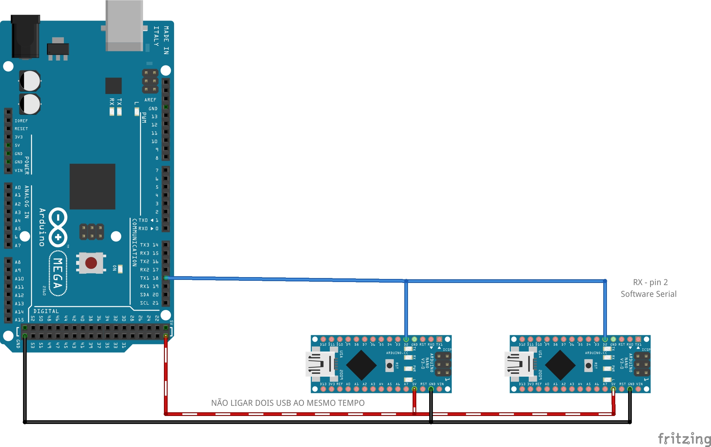

# Comunicação

testes de comunicação entre múltiplos arduinos por RS232 e/ou RS485

arduino principal: Arduino Mega usando hardware Serial1

arduinos secundários: Arduino Nano com software Serial

### ATENÇÃO

Ao interconectar o VCC entre os arduinos, não ligue mais que um por vez ao USB

#### Conexões

principal para secundários:

